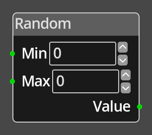

# Random

## Description

{align=left width="25%"}
The *Random Node* provides a single random number between the __Min__ and
__Max__ values provided.

 
  
-------

## Ports

Min 
: The minimum value, inclusive, of the random number.

Max 
: The maximum value, inclusive, of the random number.

Value
: An integer output port that provides the generated random number.

-------

## Parameters

Min 
: A constant integer value for the minimum, used when the __Min__ port is not
  connected.

Y 
: A constant integer value for the maximum, used when the __Max__ port is not
  connected.

