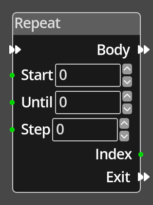

# Repeat 

## Description

 {align=left width="25%"}
 The *Repeat Node* will run the node flow that is connected to its *Body* output port
 repeatedly while an index is between the *Start* and *Until* values provided, altering
 the index value each time around the loop by the *Step* value.

 The index is first set to the *Start* value, and then it is compared to the *Until*
 value, if the *Step* is positive and the index is greater than or equal to the *Until*
 value, the loop exits, similarly, if *Step* is negative and the index is less than or
 equal to the *Until* value, the loop exits. That is, the loop runs while the index is
 *before* the *Until* value, it is "exclusive".

 During the looping, the current value of the index can be accessed by nodes in the *Body*
 using the *Index* port. Before execution, the index port is undefined, after execution
 it will contain the last value of the index before exiting the loop.

 When the loop is complete, the logic graph will continue with the flow connected to the
 *Exit* port.

 
  
-------

## Ports

Flow In
: In order for this node to perform its operation, it must be connected into an
  active flow using this input port. The flow will ultimately originate at a
  __Trigger__ node but can come from the __Flow Out__ port of any other flow
  node.

Body
: The nodes that are to be repeatedly executed during the loop. Execution will 
  continue while there is a node connected to the Flow Out of the last node
  executed, the body ends when there is no connection to the Flow Out, at which
  point the index is updated and the node will check if it is to run the loop 
  again or exit.

Start
: An integer port providing the start value of the index, this will be the value
  of the index during the first run of the *Body*, it is "inclusive".
  
Until
: An integer port providing the value to check the index against for exiting the
  loop. The loop is exited before the index reaches this value.

Step
: An integer port providing the value to add to the index each iteration through
  the loop. This value can be positive or negative, allowing loops where the index
  increases or decreases with each iteration.

Index
: An integer output port that provides the current value of the index in the loop, 
  typically used by nodes within the *Body* flow.

Exit
: A node connected to the __Flow Out__ port will be executed in sequence
  following the completion of this node's operation.

-------

## Parameters

Start 
: An integer input to specify a fixed value for the start of the loop index.

Until 
: An integer input to specify a fixed value for the exit point of the loop.

Step
: An integer input to specify a fixed value to be added to the index each iteration
  through the loop.

