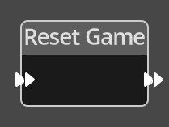

# Reset Game

## Description

{align=left width="25%"}
The *Reset Game Node* resets the game. This operation returns all objects to 
their initial position, runs the [Initialise](./initialise.md) flows on all 
objects, locations, screens and the global logic, and resets all variables
to their initial values. It will delete all dynamically spawned objects.
It will reset the starting location, but not modify the current screen.

 
  
-------

## Ports

Flow In
: In order for this node to perform its operation, it must be connected into an
  active flow using this input port. The flow will ultimately originate at a
  __Trigger__ node but can come from the __Flow Out__ port of any other flow
  node.

Flow Out
: A node connected to the __Flow Out__ port will be executed in sequence
  following the completion of this node's operation.

