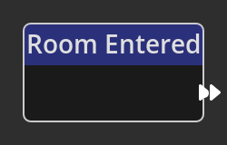

# Room Entered

## Description

{align=left} The
*Room Entered Node* is a specific type of *Node* called a __Trigger__. A trigger
*Node* is an entrypoint into a flow in the Kwyll logic. The *Room Entered* trigger
will run the flow that follows on from it's __Flow Out__ port upon entering a
[location](../../introduction/terminology.md#locations) that uses the room
definition that this logic flow is defined on.  

 

-------

## Ports

Flow Out
: As with all trigger nodes, an *Room Entered Node* has only a single flow port
  on the output side. There is no input flow to a trigger node as it is
  the origin of a flow.

