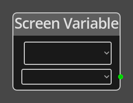

# Screen Variable

## Description

{align=left width="25%"}
The *Screen Variable Node* is used to get the integer value of a variable on
the given [Screen](../../introduction/terminology.md#screens).

 
  
-------

## Ports

*Output* 
: An integer output port that will provide the value of the chosen variable.

-------

## Parameters

Screen 
: The screen to get the variable value from, a dropdown will present a list of
  available screens to choose from.

*Variable*
: A dropdown listing the defined variables associated with the specified screen.

