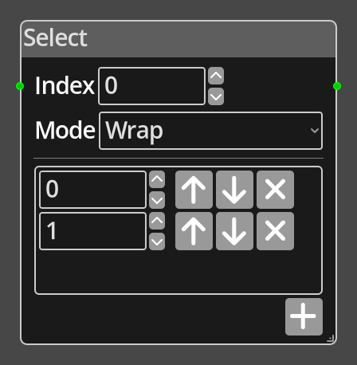

# Select

## Description

{align=left width="25%"}
The *Select Node* takes an index value and returns the appropriate entry from
a fixed list of integer values added to the node. Values are added using the 
plus button, and can be reordered and removed using the buttons next to each
list entry.

The __Mode__ parameter defines what the node will do if the provided index 
is out of range for the number of items in the list. See the [Wrap](./wrap.md)
and [Clamp](./clamp.md) nodes for details of how the two modes work.

 
  
-------

## Ports

Index 
: An integer input port used to provide the index into the list.

*Out*
: An integer output port that provides the value of the chose list item.

-------

## Parameters

Index 
: A constant integer value for the index, used when the __Index__ port is not
  connected.

Mode 
: The method to use to deal with out of range indices, __Wrap__ or __Clamp__.

