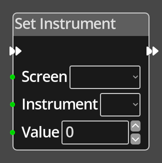

# Set Instrument

## Description

{align=left width="25%"}
The *Set Instrument Node* sets the value of an instrument on a screen. The 
screen is chosen from a fixed list of screens, the instrument is referenced 
by an index into the list of instruments on that screen.

 
  
-------

## Ports

Flow In
: In order for this node to perform its operation, it must be connected into an
  active flow using this input port. The flow will ultimately originate at a
  __Trigger__ node but can come from the __Flow Out__ port of any other flow
  node.

Flow Out
: A node connected to the __Flow Out__ port will be executed in sequence
  following the completion of this node's operation.

Instrument 
: An integer input port used to provide the index of the instrument on the screen.

Value
: An integer input port used to provide the value to apply to the instrument.

-------

## Parameters

Instrument 
: A constant integer value for the instrument index, used when the __Instrument__ 
  port is not connected.

Value
: A constant integer value for the value, used when the __Value__ port is not connected.

