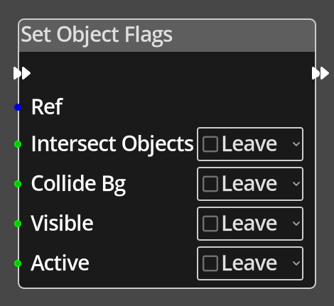

# Set Object Flags

## Description

{align=left width="25%"}
The *Set Object Flags Node* is used to modify the flags on a given object.
It can modify the flags that control whether the object registers intersection
with other objects during moving, whether the object collides with the bacground
tilemap or not, whether it is visible, and whether it is active.

The *Set Object Flags Node* is slightly different to many nodes in regards to how
the parameters are set. This is due to the fact that it can be used to only 
affect certain flags, and leave others unchanged. To accommodate this, each 
flag is represented by a "three state checkbox". The three states are 
"on", "off", and "leave". If any are set to __Leave__, that flag will not be
modified from its current state.

 
  
-------

## Ports

Flow In
: In order for this node to perform its operation, it must be connected into an
  active flow using this input port. The flow will ultimately originate at a
  __Trigger__ node but can come from the __Flow Out__ port of any other flow
  node.

Flow Out
: A node connected to the __Flow Out__ port will be executed in sequence
  following the completion of this node's operation.

Ref 
: An object reference port that provides a reference to the object to change ths flags
  of. If not connected, and the logic is on an object, the current object will be used.

Collide Bg
: An integer input port used to provide the value of the *Collide Bg* flag, 0
  is off, any other value is on.

Visible
: An integer input port used to provide the value of the *Visible* flag, 0
  is off, any other value is on.

Active
: An integer input port used to provide the value of the *Active* flag, 0
  is off, any other value is on.

On Layers
: A bit field representing the intersection layers this object belongs to, 
  bits 0 to 7 represent layers 0 to 7.

Checks Layers
: A bit field representing the intersection layers this object will check for intersections with, 
  bits 0 to 7 represent layers 0 to 7.

-------

## Parameters

Intersect Objects 
: A constant value for the *Intersect Objects* flag, used when the __Intersect Objects__ 
  port is not connected. If the value is __Leave__, the flag state will not be changed.

Collide Bg 
: A constant value for the *Collide Bg* flag, used when the __Collide Bg__ 
  port is not connected. If the value is __Leave__, the flag state will not be changed.

Visible 
: A constant value for the *Visible* flag, used when the __Visible__ 
  port is not connected. If the value is __Leave__, the flag state will not be changed.

Active 
: A constant value for the *Active* flag, used when the __Active__ 
  port is not connected. If the value is __Leave__, the flag state will not be changed.

Ignore On Layers *(checkbox labelled 'x' next to the On Layers settings)*
: If this flag is set, no changes will be made to the "On Layers" property of the object.

Ignore Checks Layers *(checkbox labelled 'x' next to the Checks Layers settings)*
: If this flag is set, no changes will be made to the "Checks Layers" property of the object.
