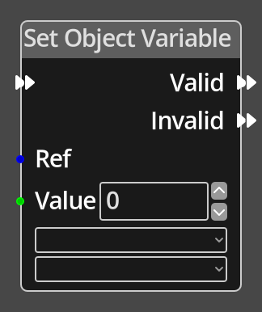

# Set Object Variable

## Description

{align=left width="25%"}
The *Set Object Variable Node* is used to set the integer value of a variable on
a given [Object](../../introduction/terminology.md#objects).

 
  
-------

## Ports

Flow In
: In order for this node to perform its operation, it must be connected into an
  active flow using this input port. The flow will ultimately originate at a
  __Trigger__ node but can come from the __Flow Out__ port of any other flow
  node.

Valid
: A node connected to the __Valid__ port will be executed in sequence if the
  specified location is using the correct Room Definition.

Invalid
: A node connected to the __Invalid__ port will be executed in sequence if the
  specified location is not using the correct Room Definition.

Ref 
: An object reference port that provides a reference to the object that contains
  the variable to be modified. If not connected, and the logic is on
  an object, the current object will be used.

Value 
: An integer input port that provides the value to be assigned to the chosen variable.

-------

## Parameters

*Variable*
: A dropdown listing the defined variables associated with the specified object.

*Object Definition*
: A dropdown listing the available object definitions. Only if the specified object
  uses the object definition chosen will the variable be modified and the valid flow
  be followed.

