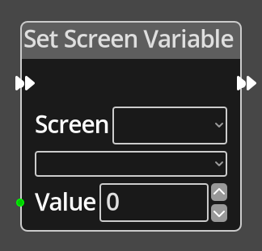

# Set Screen Variable

## Description

{align=left width="25%"}
The *Set Screen Variable Node* is used to set the integer value of a variable on
the given [Screen](../../introduction/terminology.md#screens).

 
  
-------

## Ports

Flow In
: In order for this node to perform its operation, it must be connected into an
  active flow using this input port. The flow will ultimately originate at a
  __Trigger__ node but can come from the __Flow Out__ port of any other flow
  node.

Flow Out
: A node connected to the __Flow Out__ port will be executed in sequence
  following the completion of this node's operation.

Value
: An integer input port that provides the value to assign to the chosen variable.

-------

## Parameters

Screen 
: The screen to get the variable value from, a dropdown will present a list of
  available screens to choose from.

*Variable*
: A dropdown listing the defined variables associated with the specified screen.

