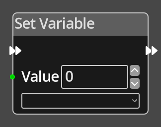

# Set Variable

## Description

{align=left width="25%"}
The *Set Variable Node* is used to set the integer value of a variable on
whatever the current logic graph is running, i.e. a
[Screen](../../introduction/terminology.md#screens), a
[Room](../../introduction/terminology.md#rooms) or an
[Object](../../introduction/terminology.md#objects).

It's important to understand that, in the case of
[rooms](../../introduction/terminology.md#rooms) and
[objects](../../introduction/terminology.md#objects) the value being modified
is the value for the chosen variable in the [Object
Reference](../../introduction/terminology.md#objects) or
[Location](../../introduction/terminology.md#locations), that is running the logic
code, each reference has it's own version of the variables, so changing a
variable on one reference for a particular object type will not affect the
value on other references, they are independent.

 
  
-------

## Ports

Flow In
: In order for this node to perform its operation, it must be connected into an
  active flow using this input port. The flow will ultimately originate at a
  __Trigger__ node but can come from the __Flow Out__ port of any other flow
  node.

Flow Out
: A node connected to the __Flow Out__ port will be executed in sequence
  following the completion of this node's operation.

Value 
: An integer input port used to provide the value that will be applied to the
  chosen variable.

-------

## Parameters

Value
: A constant integer value to assign to the chosen variable. If the port is 
  connected to another node, this option will become unavailable, the node
  will use the value provided on the input port.

*Variable*
: A dropdown listing the defined variable names on the current logic graph.

