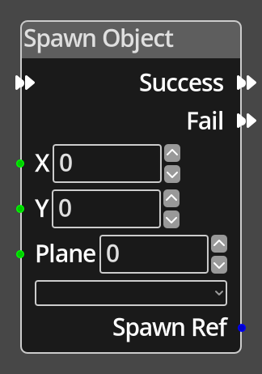

# Spawn Object

## Description

{align=left width="25%"}
The *Spawn Object Node* attempts to spawn a new dynamic object into the game.
It takes an object definition, and if there is enough dynamic object capacity left, will
create a new instance of that object definition as a map level dynamic object
at the position in map coordinates specified in the __X__ and __Y__ values.

If the operation succeeds, the flow will follow the __Success__ flow, if it
fails due to there being insufficient dynamic object slots available, it
will follow the __Fail__ flow.

If the spawn operation succeeds, the __Spawn Ref__ port will provide a reference
to the spawned object for further modification or recording in a variable. If
the spawn fails, this port value is undefined and should not be used.

 
  
-------

## Ports

Flow In
: In order for this node to perform its operation, it must be connected into an
  active flow using this input port. The flow will ultimately originate at a
  __Trigger__ node but can come from the __Flow Out__ port of any other flow
  node.

Success
: A node connected to the __Success__ port will be executed in sequence
  following the successful completion of this node's operation.

Fail
: A node connected to the __Fail__ port will be executed in sequence
  if the operation failed.

X 
: An integer input port used to provide the X value of the map coordinate.

Y 
: An integer input port used to provide the Y value of the map coordinate.

Spawn Ref
: An object reference output port that provides a reference to the spawned object
  if the operation succeeded.

-------

## Parameters

X 
: A constant integer value for the X coordinate, used when the __X__ port is not
  connected.

Y 
: A constant integer value for the Y coordinate, used when the __Y__ port is not
  connected.

*Object Definition*
: A dropdown will provide a list of possible object types to choose from to spawn.

