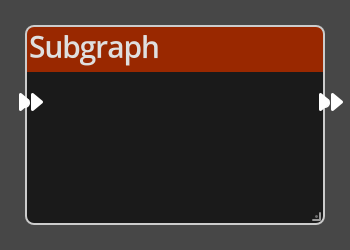

# Sub Graph

## Description

{align=left width="25%"}
The *Subgraph Node* is a means to "call" a subgraph flow defined in the Shared
Logic editor. The input and output ports on the *Sub Graph Node* will depend on the
contents of the Subgraph it is calling. 

See [Shared Logic](../../introduction/logic/logic.md#shared-logic) for more
information regarding the use of Subgraphs.

 
  
-------

## Ports

Flow In
: In order for this node to perform its operation, it must be connected into an
  active flow using this input port. The flow will ultimately originate at a
  __Trigger__ node but can come from the __Flow Out__ port of any other flow
  node.

Flow Out
: A node connected to the __Flow Out__ port will be executed in sequence
  following the completion of this node's operation.

