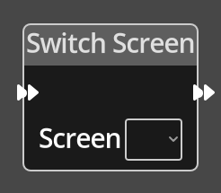

# Switch Screen

## Description

{align=left width="25%"}
The *Switch Screen Node* changes the current screen to the specified one.

 
  
-------

## Ports

Flow In
: In order for this node to perform its operation, it must be connected into an
  active flow using this input port. The flow will ultimately originate at a
  __Trigger__ node but can come from the __Flow Out__ port of any other flow
  node.

Flow Out
: A node connected to the __Flow Out__ port will be executed in sequence
  following the completion of this node's operation.

-------

## Parameters

Screen 
: The screen to get the variable value from, a dropdown will present a list of
  available screens to choose from.

