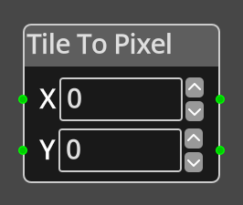

# Tile To Pixel 

## Description

{align=left width="25%"}
The *Tile To Pixel Node* takes input values X and Y that specify a position 
in tile coordinates and converts them into pixel coordinates.

The coordinate system of the input, room or map, is not important, the conversion
simply takes the pixel coordinate and returns the pixel coordinate for the tile
at the position, irrespective of whether it is on screen, in the room, or not.

 
  
-------

## Ports

X 
: An integer input port used to provide the X value of the tile coordinate.

Y 
: An integer input port used to provide the Y value of the tile coordinate.

*X Out*
: An integer output port that provides the converted X value in pixel coordinates.

*Y Out*
: An integer output port that provides the converted Y value in pixel coordinates.

-------

## Parameters

X 
: A constant integer value for the X coordinate, used when the __X__ port is not
  connected.

Y 
: A constant integer value for the Y coordinate, used when the __Y__ port is not
  connected.

