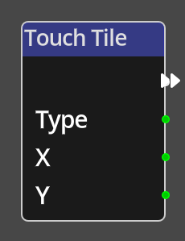

# Touch Tile

## Description

{align=left width="25%"}
The *Touch Tile Node* is a specific type of *Node* called a __Trigger__. A
trigger *Node* is an entrypoint into a flow in the Kwyll logic. The *Touch Tile*
trigger will get triggered when a tile touched by the bounding rectangle of
the object it is has a non-zero __Type__ value.

 

-------

## Ports

Flow Out
: As with all trigger nodes, a *Collided Node* has only a single flow
  port on the output side. There is no input flow to a trigger node as it is the
  origin of a flow.

Type
: An integer output port that provides the type id of the tile that the ojbect
  is touching. 

X
: An integer output port that provides the X tile coordinate of the tile that the
  object is touching.

Y
: An integer output port that provides the Y tile coordinate of the tile that the
  object is touching.
