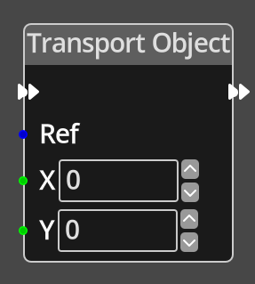

# Transport Object

## Description

{align=left width="25%"}
The *Transport Object Node* takes input values X and Y that specify a position 
to transport the specified object to.

Transporting an object differs to the function of the [Move Object](./move_object.md)
node in that it performs no intersection testing or collision detection, it 
simply moves it directly to the chosen position, as such, it is very fast and
should be preferred for moving objects when intersection and collision are not
important.

 
  
-------

## Ports

Flow In
: In order for this node to perform its operation, it must be connected into an
  active flow using this input port. The flow will ultimately originate at a
  __Trigger__ node but can come from the __Flow Out__ port of any other flow
  node.

Flow Out
: A node connected to the __Flow Out__ port will be executed in sequence
  following the completion of this node's operation.

Ref 
: An object reference port that provides a reference to the object to transport.
  If this is not connected, and the logic is on an object, the current object will be
  used.

X 
: A constant integer value for the X coordinate, used when the __X__ port is not
  connected.

Y 
: A constant integer value for the Y coordinate, used when the __Y__ port is not
  connected.

-------

## Parameters

X 
: A constant integer value for the X coordinate, used when the __X__ port is not
  connected.

Y 
: A constant integer value for the Y coordinate, used when the __Y__ port is not
  connected.

