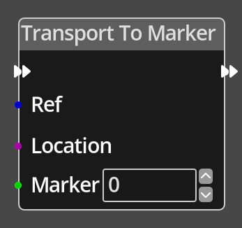

# Transport To Marker

## Description

{align=left width="25%"}
The *Transport To Marker Node* queries the position of a 
[Marker](../../introduction/terminology.md#rooms) in a given location, and immediately
transports the given object to that location, taking into account whether the object is
a room object or a map object.

 
  
-------

## Ports

Ref 
: An object reference port that provides a reference to the object to transport.
  If this is not connected, and the logic is on an object, the current object will be
  used.

Location 
: A location reference port that provides a reference to the location that the
  provided coordinates are relative to. If not connected, and the logic is on
  a location, the current location will be used.

Marker
: An integer input port that provides the index of the marker to query.

-------

## Parameters

Marker 
: A constant integer value for the marker index, used when the __Marker__ port is not
  connected.

