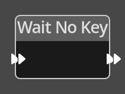

# Wait No Key

## Description

{align=left width="25%"}
The *Wait No Key Node* simply stops all logic processing until no keys are 
held down. This is used to avoid actions rolling over into other actions. For
example if a check for a key switches a game element on if it wasn't already on,
and the same key switches it off if it was, then waiting for the key to be
released in between prevents the object rapidly switching between on and off.

 

-------

## Ports

Flow In

: In order for this node to perform its operation, it must be connected into an
  active flow using this input port. The flow will ultimately originate at a
  __Trigger__ node but can come from the __Flow Out__ port of any other flow
  node.

Flow Out
: A node connected to the __Flow Out__ port will be executed in sequence
  following the completion of this node's operation.
