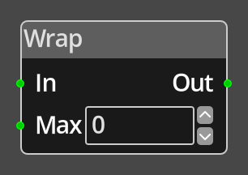

# Wrap

## Description

{align=left width="25%"}
The *Wrap Node* takes an integer value on the __In__ port, if the value is
less than 0, it will negate the value and subtract that from the __Max__ 
value minus 1, and repeat until it is greater than or equal to 0. 

If the input value is greater than or equal to the __Max__ value, it will 
subtract the __Max__ value, and repeat until it is less than the __Max__
value.

 
  
-------

## Ports

In 
: An integer input port used to provide the input value for testing. This must be
  connected for the node to operate correctly.

Out
: An integer output port, the result of the comparison detailed in the
  description is output on this port.

Max
: An integer input port, using this allows you to specify the maximum value from
  elsewhere in the logic graph, such as via an [Number](number.md) node.

-------

## Parameters

Max 
: A constant integer value for the maximum, used when the __Max__ port is not
  connected.

