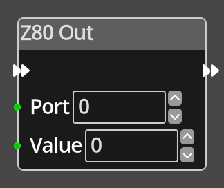

# Z80 Out

## Description

{align=left width="25%"}
The *Z80 Out Node* is a very special purpose node that allows you to perform
an output operation on the Z80 in the Spectrum. It should be used with great
care, as incorrect use can crash the machine.

An example use is to change the border colour, setting the port to 254, and the
value to a colour value between 0 and 7 will change the border colour.

 
  
-------

## Ports

Flow In
: In order for this node to perform its operation, it must be connected into an
  active flow using this input port. The flow will ultimately originate at a
  __Trigger__ node but can come from the __Flow Out__ port of any other flow
  node.

Flow Out
: A node connected to the __Flow Out__ port will be executed in sequence
  following the completion of this node's operation.

Port 
: An integer input port used to provide the port number to output the value to.

Value 
: An integer input port used to provide the value to output to the given port.

-------

## Parameters

Port 
: A constant integer value for the port number, used when the __Port__ port is not
  connected.

Value 
: A constant integer value for the value to output, used when the __Value__ port is not
  connected.

