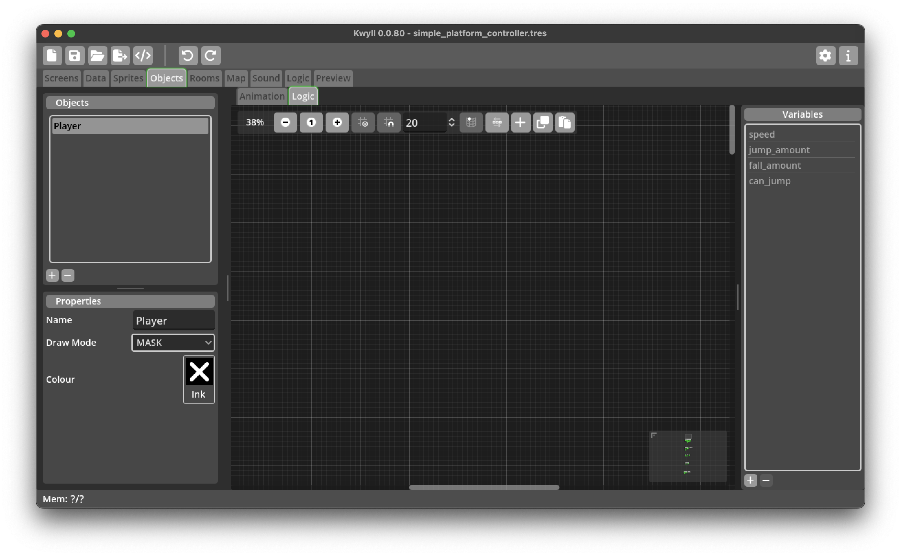
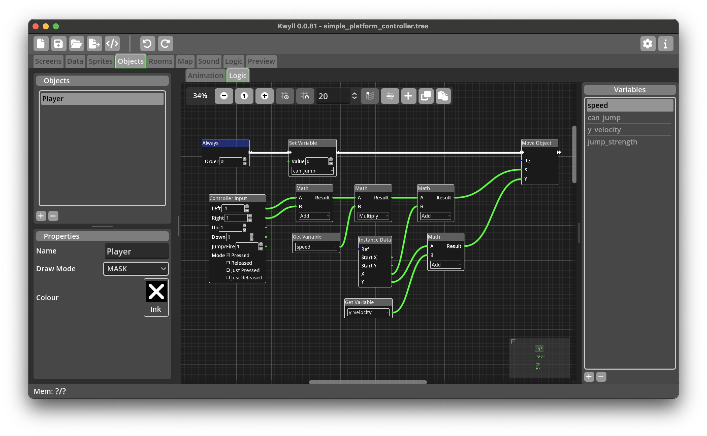
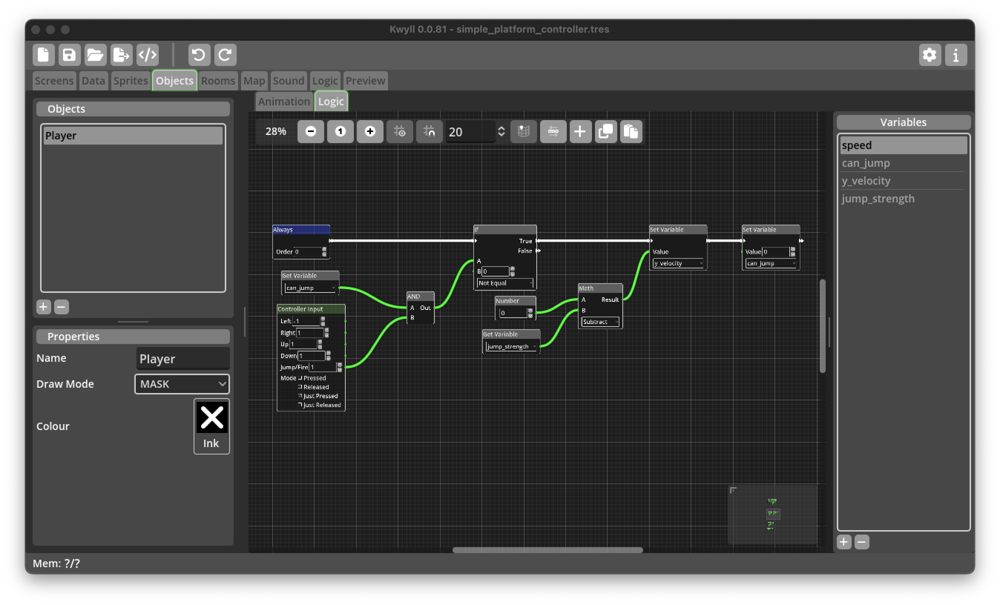
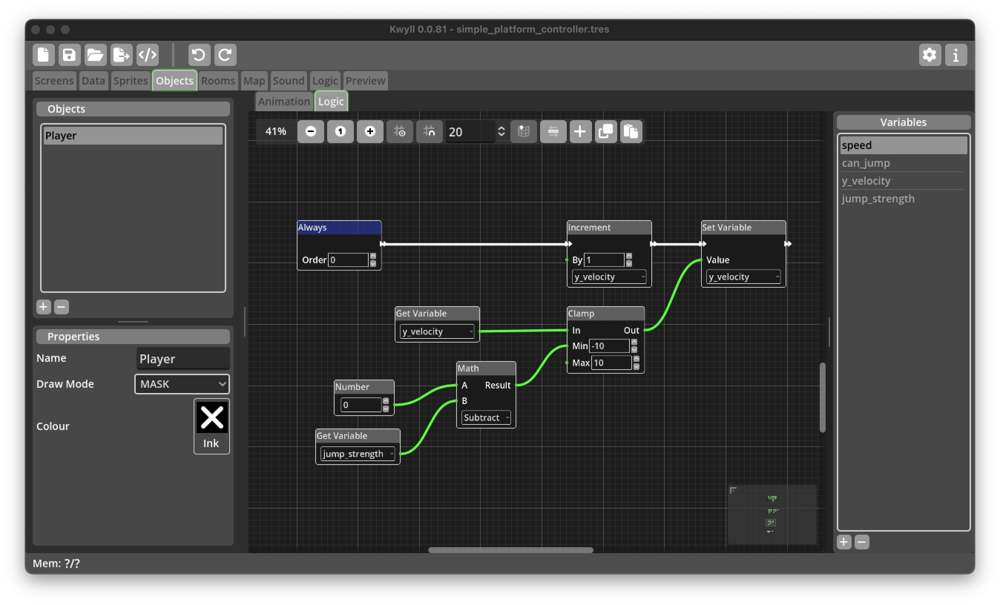
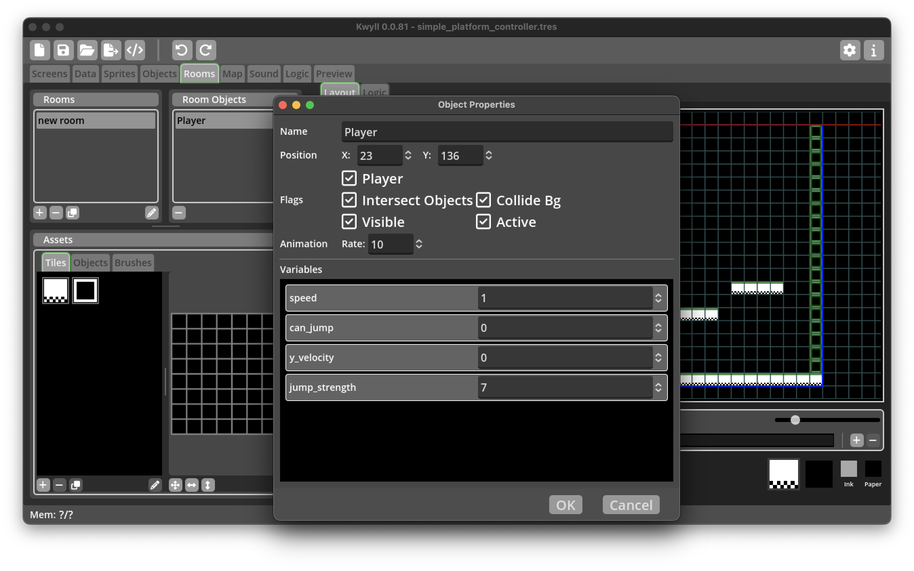

# Simple Platformer Controller

## How To Create A Simple, Left, Right and Jump Platformer Controller

One of the most common game genres for retro computers is the platformer, a
game where the player typically has controls to move left and right, and to
jump onto platforms and fall down when walking off a platform. This tutorial
guides you through creating the logic nodes to create a player object in this
style. While this very likely won't be adequate for a fully fledged game it
should give some insights into some of the techniques that Kwyll offers to do
this and serve as a starting point for customisation and improvement.

## Setup

### Sprite

First, lets start by creating a sprite for our character, something simple as
we're not focused on animation for this tutorial.

### Object

Then we'll turn this sprite into a simple object, our Player, remember to name
it appropriately and set the draw mode to mask if you've drawn a mask for your
player sprite. Add a single animation with one frame and choose the sprite you
created for your character.

### Room

Next we'll setup a simple room to test out the player. Create a single simple
tile, in the properties dialog, make sure to set the default collision to "top"
as this will be the tile for our platforms, we want to be able to jump up
through it, but then land on the top and not fall through.

Draw a ground and some platforms for our player to jump on using the tile we
just created.

Drag the Player object from the objects panel onto the room. Note: normally
the player would be a "Map" object, which allows it to travel between rooms,
but for the purposes of this tutorial, we'll just have a single room, so we can
just place our player in the room directly. 

### Map

Finally, in order to be able to play the game, we must add the room to the map.

## Logic

Now that we've got all the pieces in place, it's time to look at the core of
this tutorial, the logic. In order to keep things clear, the different steps of
the logic are implemented as separate flows, some of them could potentially be
combined if you wanted to reduce the number of nodes, that is left as an
exercise for the reader. 

We break the logic down into 5 steps, movement, jump triggering, fall
processing and landing.

Firstly, we'll need some variables to use during the logic, add the following
variables to the Player object logic:

 * speed
 * can_jump
 * y_velocity
 * jump_strength

### Movement

This flow is triggered by an "Always" trigger so will run every frame. It
serves two purposes, checking the left right keys and altering the player's
position in the horizontal direction, and applying any jump/fall amounts to
adjust the player's position in the vertical direction. Once this is done, it
will attempt to move the player to the new location.

Following the flow connections (white) you can see the first thing that happens
after the flow is triggered is to set the "can_jump" variable to 0, this is so
that should the move cause the player to fall off a platform they won't be able
to jump, if the move does not cause the player to start falling, this flag will
be reset by the [Landing](#landing) flow described below.

The next thing in the flow is the actual move, this gets the X and Y position
to move to from a set of calculations. Let's look at X first. 

The "Controller Input" node is configured to return -1 for left and 1 for
right, if either button is not pressed, it will return 0 for that direction.
These two values are added together in a "Math" node, this is to cancel out
should the player press both left and right simultaneously, as 1 + -1 is 0, if
only one button is pressed, the result will be either -1 or 1 depending on
whether left or right is pressed.

The result of this calculation is then fed into another "Math" node that
multiplies the direction by the "speed" variable. The result of this
calculation is then fed into a third "Math" node that adds it to the current X
position of the player, moving it in the correct direction by the desired
speed.

The Y position is calculated by adding the "y_velocity" variable to the current
Y position of the player.

Finally, we try to move the player to the calculated new position.

### Jump Triggering

Next, in a separate "Always" flow, we check the jump button, note the
"Controller Input" is set to "Just Pressed" for this, as we don't want the jump
to be continuous as we do for the left/right movement, this is one good reason
to keep the flows separate. 

We get the result from the "Controller Input" to see if jump has just been
pressed. We also get the value of the "can_jump" variable, and feed the result
of both of these into an "AND" node. Only if the button is pressed, and the
player can jump (both are 1), do we proceed to make the player jump. This is
done by simply setting the "y_velocity" variable to minus the "jump_strength"
variable, remember, negative in the Y direction is UP. We also set the
"can_jump" to 0, this prevents the player from jumping again until they have
landed.

### Fall Processing

Next, in yet another "Always" flow, we continuously adjust the "y_velocity" to
account for gravity. We clamp the value to always be between minus the
"jump_strength" and 10, this ensures the player never goes up by more than the
defined jump strength, and never falls faster than 10 pixels per frame.

### Landing

Finally for now, we have the logic flow that reacts when the player has
collided with something. The "Collided" trigger is automatically run when the
"Move Object" node in the [Movement](#movement) flow results in the player
hitting something. For the purposes of this tutorial, we know it can only be a
platform or the ground, but we check the direction for completeness anyway and
to ensure that collision in other directions is cleanly handled as you continue
to develop your game around this controller.

The flow first checks if the sides includes "TOP" which is 2, it does this by
logically ANDing the sides value with 2. Recall that the sides is a bit field,
bit 0 (value 1 if collided) is UP, i.e. the move resulting in the object
hitting something from below, bit 1 (value 2 if collided) is DOWN, bit 2 (value
4 if collided) is LEFT and bit 3 (value 8 if collided) is RIGHT. The actual
valud of sides is a potential combination of these values, for example, if the
object collided in both the DOWN and LEFT directions, the value will be 2 + 4 =
6, ANDing with 2, will remove any other directions from the value but the DOWN
value, so if the player does collide both DOWN and LEFT, LEFT will be ignored,
the output from 6 AND 2 is 2, as illustrated by the binary representation below. 

                RLDU
    6       00000110
    2       00000010

Only if both "bits" in the binary number are 1, will the bit be 1 in the
result, so the result of ANDing these two number will be 00000010 in binary,
which is 2. This means we can just compare the result with 2 to check if the
object collided in a downwards direction at all, irrespective of whether it
collided in another direction as well or not.

If this is true, we set "can_jump" variable to 1 to indicate that the player
can now jump again as they have landed.

## Testing

Back in the Room Editor, open the object properties dialog for the player and
make sure the "Collide Bg" flag is set so that the player object will collide
with our platform tiles. 

In the Variables section of the object properties, you'll need to set the
values of "speed" and "jump_strength" to suitable values, 1 and 7 will be good
for our example, but you can tweak those as you choose.

That should be all that is required to get a basic platformer control working
in Kwyll. Switch to the Preview tab and start the game, you should be able to
move left and right, and jump up onto the platforms. When you walk off a
platform the player should fall to the ground.

<video width="640" height="480" controls autoplay="true" loop="true">
  <source src="../../assets/tutorials/simple_platformer_controller/play.webm"
  type="video/webm">
  

    
  

</video>
